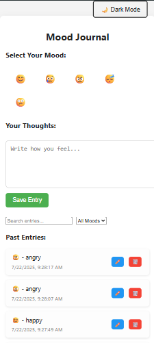
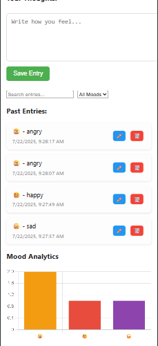

Mood Journal - React App
A simple, beautiful journaling web app built using React. Users can log their mood and thoughts for the day, view past entries, edit or delete them — all in a clean, responsive interface with light/dark mode support.

Features :

1. Add journal entries with mood & message

2. View, edit, and delete previous entries

3. Toggle between dark and light themes

4. Automatic timestamping of each entry

5. Realtime list updates

6. Minimal, mobile-friendly design

Tech Stack: 

Frontend: React, HTML5, CSS3, JavaScript

Icons: Emoji for simplicity

Styling: Custom CSS (no frameworks used)

(No backend yet – entries are session-based)

Screenshots:

